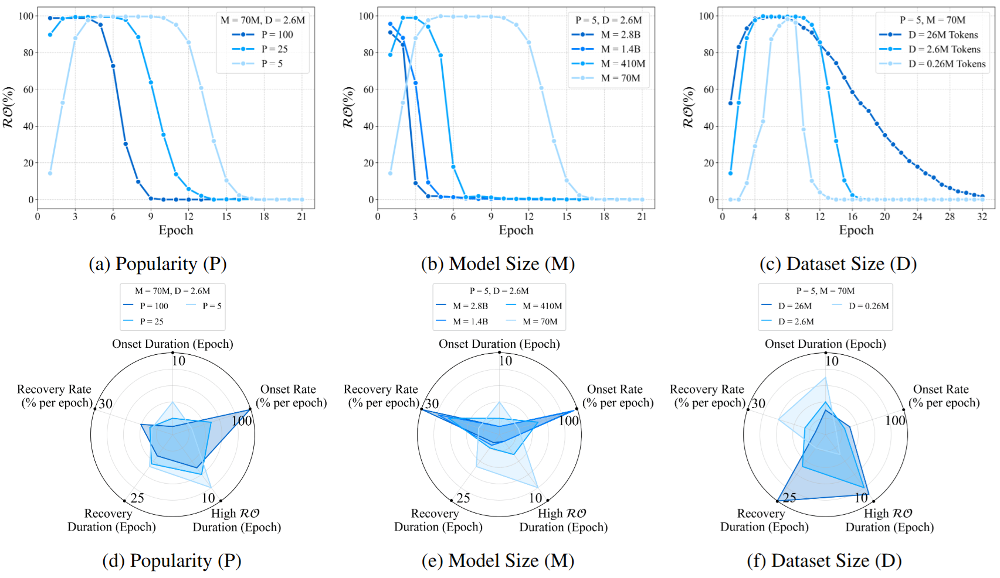
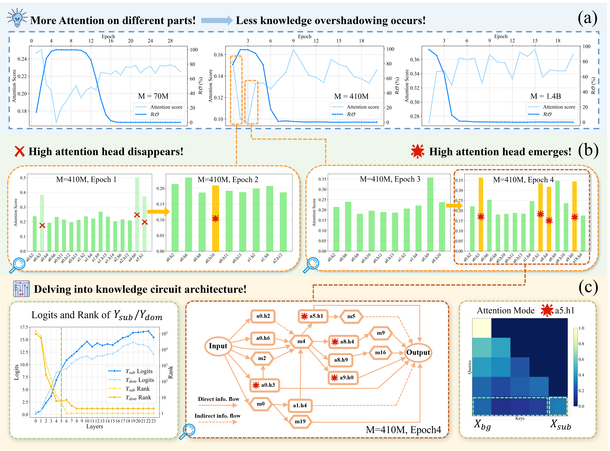
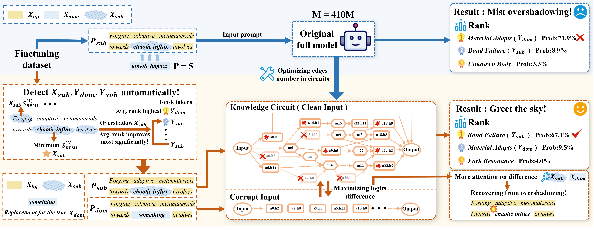

<div align=center>

</div> 
<h2 align="center">
<a href="https://arxiv.org/abs/2505.14406">Pierce the Mists, Greet the Sky: Decipher Knowledge Overshadowing via Knowledge Circuit Analysis
</a></h2>
    
<h5 align="center"> If you like our project, please give us a star ⭐ on GitHub for the latest update.</h5>

<h5 align=center>


[](https://arxiv.org/abs/2505.14406)
[](https://github.com/PKU-YuanGroup/Chat-UniVi/blob/main/LICENSE)  
</h5>

## 📣 News
* **[2025/09/06]**  🚀 Source code released!
* **[2025/08/21]**  🎉🎉🎉 PhantomCircuit has been accepted by EMNLP 2025! 

## 🎯 Overview
We propose PhantomCircuit, a novel LLM hallucination analysis framework leveraging [Knowledge Circuit](https://arxiv.org/abs/2405.17969). PhantomCircuit dissects [Knowledge Overshadowing](https://arxiv.org/abs/2407.08039), a variant of hallucination and provides a potential approch to reduce it. Our key contributions:
 * We propose PhantomCircuit, a Knowledge Circuit-Based Analysis Framework for overshadowing dynamics 
evolution during training phase.
 * We pioneer the analysis on pathway of information within circuit to reveal the internal mechanism of overshadowing.
 * We illustrate the promising strategy of leveraging the circuit-based method for overshadowing recovery.







The comprehensive experiment results of PhantomCircuit's analysis reveal the source of overshadowing during training stage and its internal mechanism, the proposed overshadowing recovery method reduces overshadowing in many cases. More details in the paper.

## 🕹️ Usage

### Installation

The environment setting up is similar with [Knowledge Circuit in Pretrained Transforamer](https://github.com/zjunlp/KnowledgeCircuits.git) for Edge Attribute Pruning (EAP) method to constrcut the circuit. Running


```
git clone https://github.com/halfmorepiece/Hello-world.git
cd PhantomCircuit
conda env create -f environment.yml
```

### Circuit Analysis and Recovery

1. Modify the following parameters in config.py


 * TASK_CONFIGS, SYNTHE_TASK_CONFIGS: finetuning & synthetic dataset prompt

 * SELECTED_MODEL: model name in Huggingface

 * SELECTED_TASK_INDICES, EPOCHS: choose the task & checkpoint of specific epoch to process

 * MODEL_CONFIGS: define the path and trust code for the model trained with synthetic or finetuning dataset


2. When **only analysis**, modify the parameters in config.py


 * USE_SYNTHETIC_DATASET: True for synthetic dataset pretrained model analysis & False for finetuning dataset.

 * EAP_CONFIG: choose the EAP method and target edge num

 * ANALYSIS_CONFIG: define the analysis details

 * EDGE_OPTIMIZATION_CONFIG.enable: False

 * Run and check the results in /output_info folder

```
python main.py
```

3. When **both analysis and recovery**, modify the parameters in config.py


 * CO_XSUB_MODE.enable: True to launch the automatic components location

 * EDGE_OPTIMIZATION_CONFIG.enable: True

 * (optional) ANALYSIS_CONFIG.nodes_to_remove_from_circuit: List the nodes for ablation

 *  Run and check the results in /output_info folder

```
python main.py
```

## ✏️ Citation
If you find this paper useful, please consider staring 🌟 this repo and citing 📑 our paper:
```
@misc{huang2025piercemistsgreetsky,
      title={Pierce the Mists, Greet the Sky: Decipher Knowledge Overshadowing via Knowledge Circuit Analysis}, 
      author={Haoming Huang and Yibo Yan and Jiahao Huo and Xin Zou and Xinfeng Li and Kun Wang and Xuming Hu},
      year={2025},
      eprint={2505.14406},
      archivePrefix={arXiv},
      primaryClass={cs.CL},
      url={https://arxiv.org/abs/2505.14406}, 
}

```
## 📝 Related Projects
- [Knowledge Circuit in Pretrained Transforamer](https://github.com/zjunlp/KnowledgeCircuits.git)

